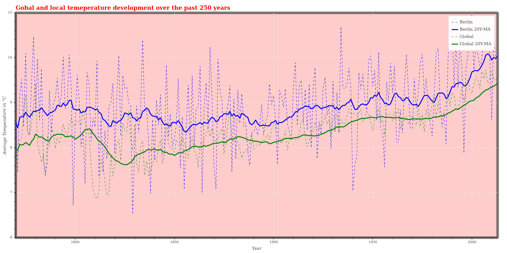

# Project Summary
## Introduction
The first project in the Data Analyst Nanodegree is about exploring the global and local weather trend by the average yearly temperature. The project consists of:
- getting the data from a SQL database and export it to CSV
- load and process the data in a python notebook
- visualize the data in the notebook

## Requirements
The project was done in a Python Jupyter Notebook and utilized Pandas- and Bokeh Packages.

## Run the project
Star the jupyter notebook from commandline
```
jupyter notebook weather_trend.ipynb
```
And run all cells.

## Analysis
### Data Extraction
The Data was extracted first for the global temperature data 
```
SELECT *
FROM global_data;
```
and then for the local data for the city nearest to me (Berlin)
```
SELECT city, year, avg_temp
FROM city_data
WHERE city LIKE 'Berlin';
```

### Data pre processing
Between the local and global data are some inconsistencies that had to be resolved.
The global data started at 1750 where the local at 1743 and also had some NaN values which had to be removed.
The local data ended at 2013 where the global data ended at 2015 and so those had to be removed as well.

### Calculate Moving averages
The Moving averages where calculated by Panda's rolling() method and apply the mean() method. The 5 year, 10 year and 20 year moving average were calculated and the 20 year moving average turned out to be best suited. The other ones are too volatile still.

```
# calculate the moving average with panda's rolling() method
# local weather, 5, 10, 20 years moving average
local_weather_clean['5Y-MA'] = local_weather_clean['avg_temp'].rolling(window = 5).mean()
local_weather_clean['10Y-MA'] = local_weather_clean['avg_temp'].rolling(window = 10).mean()
local_weather_clean['20Y-MA'] = local_weather_clean['avg_temp'].rolling(window = 20).mean()

# global weather, 5, 10, 20 years moving average
global_weather_clean['5Y-MA'] = global_weather_clean['avg_temp'].rolling(window = 5).mean()
global_weather_clean['10Y-MA'] = global_weather_clean['avg_temp'].rolling(window = 10).mean()
global_weather_clean['20Y-MA'] = global_weather_clean['avg_temp'].rolling(window = 20).mean()
```

### Calculate the Correlation coefficient
The correlation coeffient was calculated with Panda's corr() method.
```
global_weather_clean['avg_temp'].corr(local_weather_clean['avg_temp'])
```
It turned out to be around 0.51 for the yearly data and about 0.91 for the 20 year moving average data. Which is not surprising, given the high standard deviation of each. In general though, both are positively correlated.

### Average Difference
When calculating the average difference of the two temperatures in order to estimate the local temperature based on the global data, it turns out for the 20 year movining average it's about 0.6 °C with a standard deviation of about 0.16 and could therefore be estimated.
When taken the yearly average the standard deviation is about 0.77 and that makes the estimate unreliable.

### Visualization
Visualization was done with Bokeh and exported to png wiht the integrated export capabilities.


### Interpretation
The following things can be observed from the plot
- the global average is less noisy than the local Berlin average measurement
- the local 20 year moving average of Berlin is alway higher than of the global temperature
- from the moving average of the global data, it's getting steadily warmer since 1825 and in took on momentum in the past 30 year
- the lowest temperature in Berlin was measured in 1829 with about 6.5 °C, the highest average in 2000 with about 11 °C
- the lowest temperature in globally was measured in 1811 with about 6.9 °C, the highest average in 2007 with about 9.7 °C
